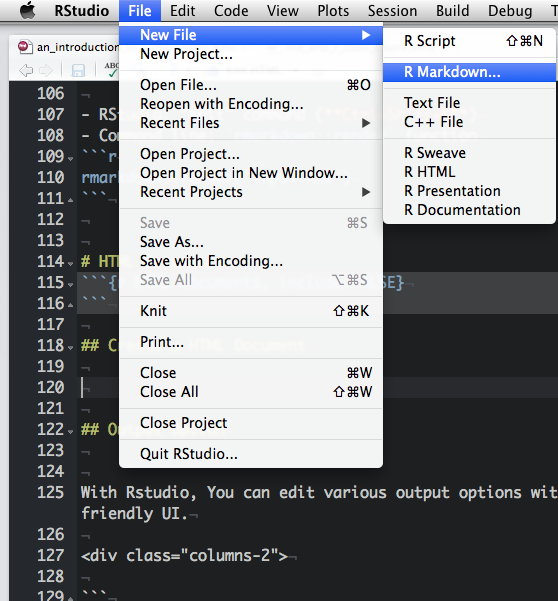
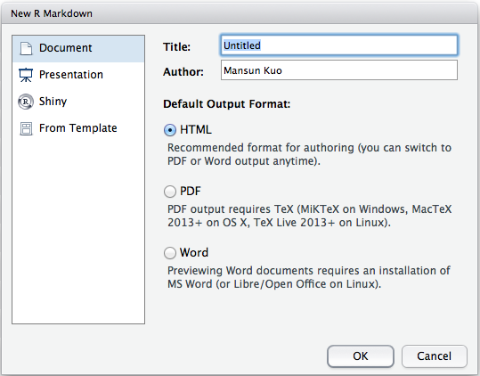
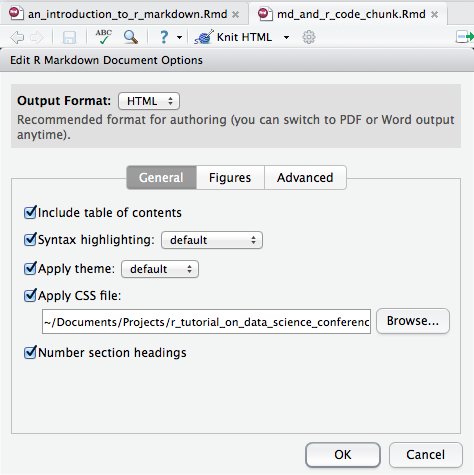
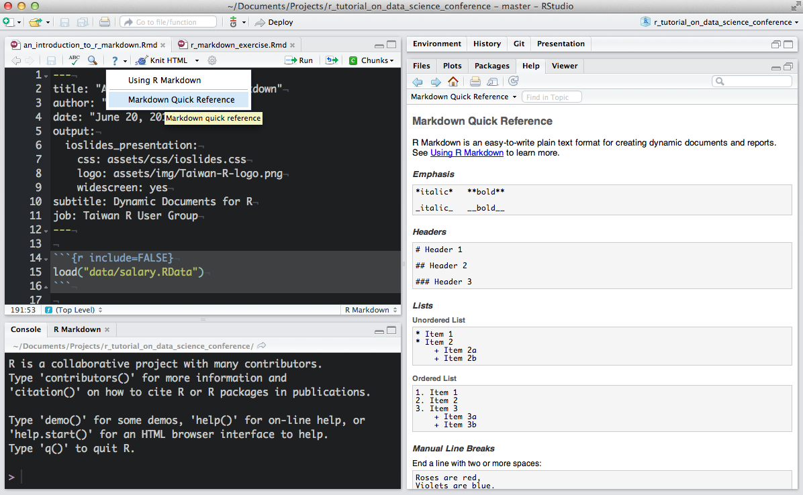
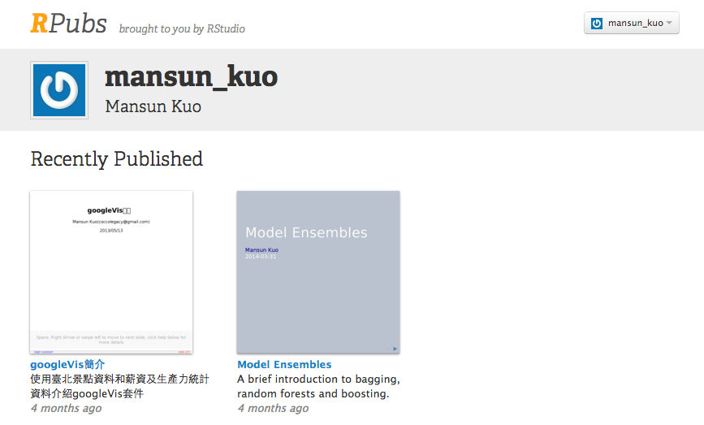
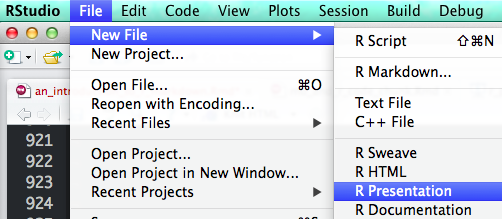
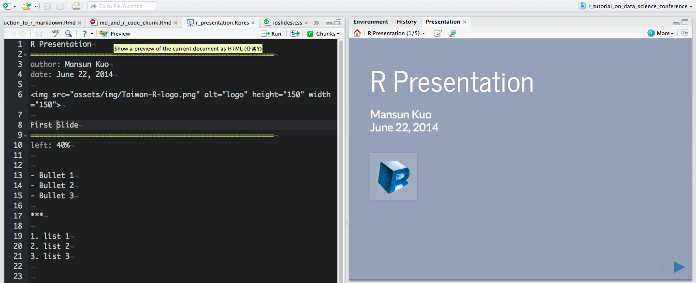
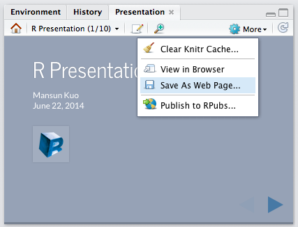
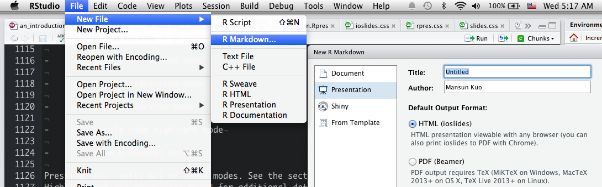
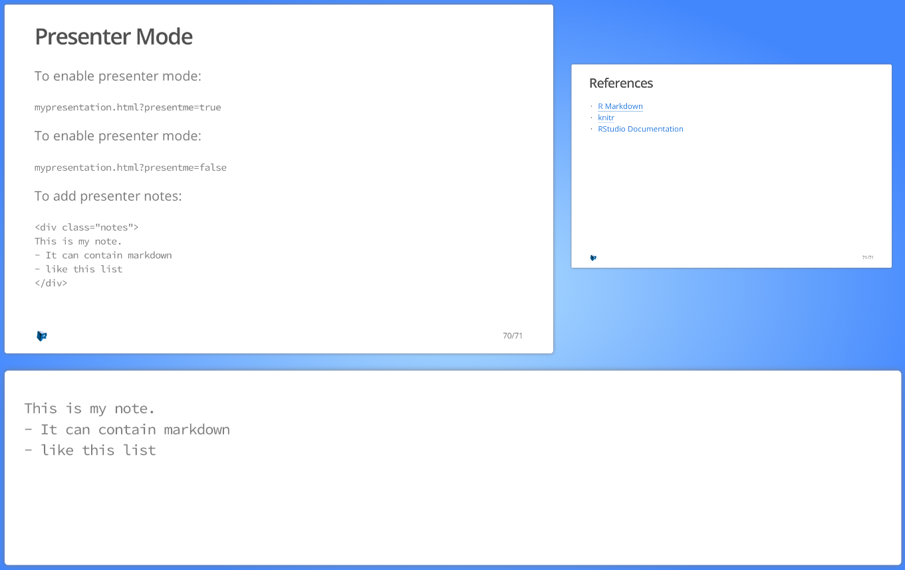

```{r include=FALSE}
load("data/salary.RData")
```


## Outline {#Outline}
```{r Outline}
```

- Preface
- HTML documents
- R Code Chunks
- Markdown Basics
- R Presentation
- ioslides
- Miscellaneous


# Preface
```{r Preface}
```


## It happened everyday {.build}

<div class="columns-2">

1. Data preparation
2. Modeling
3. Generating report
4. Something wrong in your data
5. Repeat 1 ~ 4


</div>


## {.flexbox .vcenter .emphasized}

Local data scientists need better tool!


## Research Pipeline {.smaller .centered}


[Roger D. Peng, Reproducible Research: Concept and Ideas p.10 on Coursera](https://www.coursera.org/course/repdata)


## R Markdown

- [Markdown](http://daringfireball.net/projects/markdown/basics)
    - Remove HTML tag for higher readibility.
    - Inline HTML is avaliable.
- R markdown
    - Markdown + embedded R code chunks
    - Rmd -> md -> html(docx, pdf)
    - Literate Programming


## Version

- v1: based on package knitr and markdown
- v2: based on knitr and [pandoc](http://johnmacfarlane.net/pandoc/), intergrated into RStudio v0.98.932 or later
    - default bootstrap template
    - docx and pdf
    - slides with ioslides and Beamer
    - embedded shiny apps
- keep using R Markdown v1

```html
<-- rmarkdown v1 -->
```


## Installing R Markdown

- RStudio --- Install the [latest version of RStudio](http://www.rstudio.com/ide/download/preview)

- Other environments --- Install the [rmarkdown package](https://github.com/rstudio/rmarkdown).


## Overview

- YAML Metadata: [YAML](http://en.wikipedia.org/wiki/YAML) document options
- Markdown: Article text
- R Code Chunk: Executible R code


## Rendering Output

- RStudio: "Knit" command (**Ctrl+Shift+K**)
- Command line: `rmarkdown::render` function
```r
rmarkdown::render("input.Rmd")
```


# HTML Documents
```{r HTML Documents, include=FALSE}
```

## Create a HTML Document

<div class="columns-2">


</div>

## Output Option


With Rstudio, You can edit various output options with friendly UI.

<div class="columns-2">

```
---
title: "R Markdown Exercise"
author: "Mansun Kuo"
date: "July 24, 2014"
output:
  html_document:
    css: assets/css/custom.css
    fig_caption: no
    fig_height: 5
    fig_width: 7
    highlight: default
    keep_md: no
    number_sections: no
    theme: default
    toc: yes
---
```




</div>


## Apply CSS Style


**CSS:**

```css
#nextsteps {
   color: blue;
}

.emphasized {
   font-size: 1.2em;
}
```

**Apply to Whole Section:**

```
### Apply to Whole Section {#nextsteps .emphasized}
```

## Exercise

使用R Studio產生一個HTML文件，調整成自己喜歡的樣式。


# Markdown Basics
```{r Markdown Basics}
```

## Markdown Quick Reference




## Emphasis
```markdown
*italic*   **bold**

_italic_   __bold__
```

*I am italic*   

**I am bold**


## Headers

Setext:


```markdown
Header 1
=============

Header 2
-------------
```

atx:

```markdown
# Header 1

## Header 2

### Header 3
```


## Manual Line Breaks

End a line with two or more spaces:

```markdown
Roses are red,  
Violets are blue.
```


## Lists


<div class="columns-2">
```html
Unordered List:

* Item 1
* Item 2
    + Item 2a
    - Item 2b

Ordered List:

1. Item 1
2. Item 2
3. Item 3
    + Item 3a
    + Item 3b


```

Unordered List:

* Item 1
* Iteivm 2
    + Item 2a
    - Item 2b

Ordered List:

1. Item 1
2. Item 2
3. Item 3
    + Item 3a
    + Item 3b

</d>


## The Four-space Rule

Subsequent paragraphs must be preceded by a blank line and indented four spaces or a tab.


<div class="columns-2">

```markdown
* fruits

    delicious!!!
    + apples
        - macintosh
        - red delicious
    + pears
    + peaches
* vegetables  
  healthy!!!
    + broccoli
    + chard


```

* fruits

    delicious!!!
    + apples
        - macintosh
        - red delicious
    + pears
    + peaches
* vegetables  
  healthy!!!
    + broccoli
    + chard


</div>

## R Code Chunks

R code will be evaluated and printed


<!--pre class="prettyprint lang-r"><code>&#96;&#96;&#96;{r}-->
<pre class="markdown"><code>&#96;&#96;&#96;{r}
summary(cars$dist)
&#96;&#96;&#96;
</code></pre>


```{r}
summary(cars$dist)
```


## Inline R Code


<br>

```r
I counted `r 1+1` red trucks on the highway.
```


## Links

A plain http address or add a link to a phrase.

**Inline Link:**

```html
[2014台灣資料科學愛好者年會](http://twconf.data-sci.org/)
```
[2014台灣資料科學愛好者年會](http://twconf.data-sci.org/)

**Reference Link**:


```html
[2014台灣資料科學愛好者年會][dsc]
[dsc]: http://twconf.data-sci.org/
```

[2014台灣資料科學愛好者年會][dsc]

[dsc]: http://twconf.data-sci.org/


## Images


<div class="columns-2">

**Inline Image**:

```html


```


<br><br>


**Reference Image**:

```html
![logo][R]

[R]: assets/img/Taiwan-R-logo.png "R logo"
```
![logo][R]

[R]: assets/img/Taiwan-R-logo.png "R logo"


</div>


## Blockquotes

```markdown
A friend once said:

> It's always better to give
> than to receive.
```


## Plain Code Blocks

- Plain code blocks are displayed in a fixed-width font but not evaulated.

    <pre class="markdown"><code>&#96;&#96;&#96;
    This text is displayed verbatim / preformatted
    &#96;&#96;&#96;
    </code></pre>

- Specify the language of the block is avaliable

    <pre><code>```r
    x = rnorm(10)
    ```</code></pre>

    ```r
    x = rnorm(10)
    ```


## Embedding Equations

- LaTeX
    - Inline equation: `$equation$`  
      
    - Display equation: `$$ equation $$`
      
    - Useful Resources
        - [Daum Equation Editor](https://chrome.google.com/webstore/detail/daum-equation-editor/dinfmiceliiomokeofbocegmacmagjhe?utm_source=chrome-ntp-icon): Chrome Plugin
        - [Online LaTeX Equation Editor](http://www.codecogs.com/latex/eqneditor.php)
- MathML
    - *`<math ...> </math>`* for  equations.


## Horizontal Rule / Page Break

Three or more asterisks or dashes:

```markdown
******

------
```

## Tables

<div class="columns-2">
```html
First Header  | Second Header
------------- | -------------
Content Cell  | Content Cell
Content Cell  | Content Cell


```

First Header  | Second Header
------------- | -------------
Content Cell  | Content Cell
Content Cell  | Content Cell

</div>


## Exercise

加上報告的段落標題

- 油電業薪資近9萬，是教服業的4倍?
- 實質薪資倒退十五年？


# R Code Chunks
```{r R Code Chunks}
```


## Overview

- Named R code chunk. 

    <pre class="markdown"><code>&#96;&#96;&#96;{r plot}
    summary(cars)
    plot(cars)
    &#96;&#96;&#96;
    </code></pre>

- Easy Navigation in RStudio  

    


## Basic Chunk Option

- `echo`(TRUE): whether to include R source code in the output file
- `eval`(TRUE): whether to evaluate the code chunk
- `message`(TRUE): whether to preserve messages emitted by message()
- `include`(TRUE): if include=FALSE, nothing will be written into the output document, but the code is still evaluated and plot files are generated
- `warning`(TRUE): whether to preserve warnings in the output 

<pre class="markdown"><code>&#96;&#96;&#96;{r plot, include=FALSE}
# Disable all output 
&#96;&#96;&#96;
</code></pre>

<pre class="markdown"><code>&#96;&#96;&#96;{r plot, echo=FALSE}
# Hide source code
&#96;&#96;&#96;
</code></pre>


## Plots

- `dev`('png'): figure format(png, jpeg, tiff, svg, ...)
- `fig.path`('figure/'): figure path
- `fig.width`(7): figure width
- `fig.height`(7): figure height
- `dpi`(72): DPI (dots per inch)

<pre class="markdown"><code>&#96;&#96;&#96;{r dev='svg', fig.path='myplot', fig.height=8}
plot(iris)
&#96;&#96;&#96;
</code></pre>


## Table Output

Set `results='asis'` to write raw results from R into the output document

<div class="columns-2">

- `knitr::kable`

    <pre class="markdown"><code>&#96;&#96;&#96;{r, results='asis'}
    knitr::kable(women)
    &#96;&#96;&#96;
    </code></pre>

- `xtable::xtable`

    <pre class="markdown"><code>&#96;&#96;&#96;{r, results='asis'}
    print(xtable::xtable(women), 
          type="html", 
          include.rownames=FALSE)
    &#96;&#96;&#96;
    </code></pre>

```{r results='asis', echo=FALSE}
knitr::kable(head(women))
# print(xtable::xtable(head(women)), 
#       type="html", 
#       include.rownames=FALSE
#       )
```

</div>

## Caching

- `cache`(FALSE): whether to cache a code chunk to improve proformance for expensive computing

- Caching globally for a document 


<pre class="markdown"><code>&#96;&#96;&#96;{r setup, include=FALSE}
knitr::opts_chunk$set(cache=TRUE)
&#96;&#96;&#96;
</code></pre>

- If you run into problems with cached output, you can always clear the knitr cache by removing the folder named with a `_cache` suffix.


## Language Engines

- `engine`('R'): the language name of the code chunk
    - 'bash'
    - 'python'
    - 'Rcpp'

<pre class="cpp"><code>&#96;&#96;&#96;{r engine='bash'}
whoami
&#96;&#96;&#96;
</code></pre>


```{r engine='bash'}
whoami
```

## Exercise

結合適當的圖表和文字敘述，
將從每人每月平均薪資和消費者物價指數資料中觀察到的現象完成一份完整的報告。

- [新聞連結](http://news.ltn.com.tw/news/focus/paper/758561)
- 主題
    - 實質薪資倒退十五年？
    - 油電業薪資近9萬，是教服業的4倍？


# Deployment
```{r Deployment}
```


## Publish

There are various way to publish your document on the web. 

- [RPubs](https://rpubs.com)
    - [RPubs](https://rpubs.com/about/getting-started)
    - [markdown::rpubsUpload](http://www.rforge.net/doc/packages/markdown/rpubsUpload.html)
- file hosting service
    - [Dropbox](https://www.dropbox.com/help/16/en)
    - [Google Drive](https://support.google.com/drive/answer/2881970?hl=en)


## Exercise

Deploy your slides on the web.




# R Presentation
```{r R Presentation}
```


## Overview

- A feature of RStudio that enable easy authoring of HTML5 presentations based on R Markdown.
- Special Feature
    - Extensive support for authoring and previewing presentations within the RStudio IDE
    - Flexible two column layouts
- Getting Started  




## Slide Basics

Set global option in first slide.

```yaml
R Presentation
========================================================
author: Mansun Kuo
date: June 22, 2014
```

Slides automatically display their titles unless `title: false` is specified.

```yaml
Slide 1
====================================
title: false

- Bullet 1
- Bullet 2
- Bullet 3
```

## Preview

- Every time you save your presentation the preview is refreshed and navigated to whatever slide you were editing.
- Within the preview pane, you can press the Edit button on the toolbar to jump immediately to it's location in the source file.




## Two Column Layout


```yaml
Two-Column Slide
====================================
left: 70%

First column
***
Second column
```

## Transitions

- `transition`: transition style
    - none, **linear**, rotate, fade, zoom, concave

- `transition-speed`: transition speed
    - **default**, slow, fast

```yaml
R Presentation
========================================================
author: Mansun Kuo
date: June 22, 2014
transition: rotate
transition-speed: fast
```


## Slide Type

- `type`: slide appearance
    - section, sub-section, prompt, alert

```yaml
Type
========================================================
type: sub-section
incremental: true
```


## Incremental Display

- `incremental`: display content incrementally
    - true, **false**

```yaml
Incremental Display
========================================================
incremental: true

- Bullet 1
- Bullet 2
- Bullet 3
```


## Preview -> More

- `Clear Knitr Cache`: clear knitr cache for this presentation
- `View in Browser`: view the presentation in an external web browser
- `Save AS Web Page`: save the presentation as a standalone web page 
- `Publish to RPubs`: publish the presentation to [RPubs](https://rpubs.com/)




## Custom CSS

```yaml
R Presentation
========================================================
author: Mansun Kuo
date: June 22, 2014
css: assets/css/rpres.css
```


## Applying Styles

Apply to individual slides:

```yaml
My Slide
===================================
class: illustration
```

Apply to spans of text:


```html
My Slide
================================== 
<span class="emphasized">Pay attention to this!</span>
```


## Exercise

建立一個R Presentation


# ioslides
```{r ioslides}
```


## Overview

- A feature of RStudio that create an [ioslides](https://code.google.com/p/io-2012-slides/) presentation.
- Special Feature
    - Code Highlighting
    - Presenter mode
- Getting Started  




## Section

- `#`: create a section
- `##`: create a new slide
- `---`: create a new slide without a header(horizontal rule)
- `|`: add a subtitle


```yaml
# section

## slide 1

---

## slide 2 | with subtitle
```


## Display Modes

-   `'f'` enable fullscreen mode

-   `'w'` toggle widescreen mode

-   `'o'` enable overview mode

-   `'h'` enable code highlight mode

-   `'p'` show presenter notes

-   `'Esc'` exits all of these modes.


## Incremental Bullets

```yaml
---
output:
  ioslides_presentation:
    incremental: true
---
```

Render bullets incrementally for specific slide:

```markdown
> - Eat eggs
> - Drink coffee
```

> - Eat eggs
> - Drink coffee


## Presentation Size

- `widescreen`: widescreen mode
- `smaller`: smaller text

```yaml
---
output:
  ioslides_presentation:
    widescreen: true
    smaller: true
---
```

Set smaller text for specific slide:

```markdown
## Getting up {.smaller}
```


## Transition Speed

`transition`: **default**, slower, faster

```yaml
---
output:
  ioslides_presentation:
    transition: slower
---
```

## Build Slides {.build}


Let content be displayed incrementally.

```markdown
## Build Slides {.build}
```


## Adding a Logo

Add a 128x128 logo:

```yaml
---
output:
  ioslides_presentation:
    logo: logo.png
---
```


## Code Highlighting

Using `### <b>` and `### </b>` to enclose the lines you want to highlight.


```r
### <b>
x <- 10
### </b>
y <- 20
```

## Center {.flexbox .vcenter}

<div class="centered">
To center content on a slide:

```html
## Center {.flexbox .vcenter}
```

To horizontally center content:

```html
<div class="centered">This text is centered.</div>
```
</div>


## Two-column 

Note that the content will flow across the columns.

```html
<div class="columns-2">
  

  - Bullet 1
  - Bullet 2
  - Bullet 3
</div>
```


## Text Color

You can color content using base color classes red, blue, green, yellow,
and gray (or variations of them e.g. red2, red3, blue2, blue3, etc.).

```html
<div class="red2">
This text is red
</div>
```


```{r results='asis', echo=FALSE}
library(whisker)
temp = '<span class="{{color}}{{number}} ">{{color}}{{number}}</span>'
numbers = c("", "2", "3")
colors = c("red", "blue", "green", "yellow", "gray")
for (color in colors){
    cat("- ")
    for (number in numbers){
        out = whisker.render(temp)
        cat(out)
    }
    cat("\n")
}
```


## Presenter Mode


<div class="columns-2">

To enable presenter mode:

```html
mypresentation.html?presentme=true
```

To disable presenter mode:

```html
mypresentation.html?presentme=false
```

<div class="notes">
    This is my note.
    - It can contain markdown
    - like this list
</div>




</div>

To add presenter notes:

```html
<div class="notes">
This is my note.
- It can contain markdown
- like this list
</div>
```


## Exercise

建立一個ioslides


# Miscellaneous 
```{r Miscellaneous}
```


## Generate Markdown and HTML

<pre class="prettyprint lang-r"><code>&#96;&#96;&#96;{r results='asis', echo=FALSE}
library(whisker)
temp = '<span class="{{color}}{{number}} ">{{color}}{{number}}</span>'
numbers = c("", "2", "3")
colors = c("red", "blue", "green", "yellow", "gray")
for (color in colors){
    cat("- ")
    for (number in numbers){
        out = whisker.render(temp)
        cat(out)
    }
    cat("\n")
}
</code></pre>


## Some Useful HTML

- [iframe](http://www.w3schools.com/tags/tag_iframe.asp): 鑲嵌其他網頁
```html
<iframe src="http://twconf.data-sci.org/" height=600 width=800></iframe>
```

- [img](http://www.w3schools.com/tags/tag_img.asp): 插入圖片，較容易調整長寬
```html

```

---

<iframe src="http://spark.rstudio.com/mansunkuo/googleVis_shiny/"></iframe>


## References

- [R Markdown](http://rmarkdown.rstudio.com/)
- [knitr](http://yihui.name/knitr/)
- [RStudio Documentation](https://support.rstudio.com/hc/en-us/categories/200035113-Documentation)
- [Reproducible Research](https://www.coursera.org/course/repdata)
